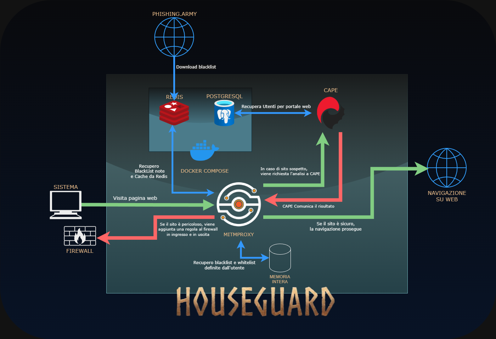

# HouseGuard_NS

<p align="center" width="100%">
    
</p>

## Partecipanti

- Simone De Lucia M63001720
- Gabriel Covone M63001809
- De Prophetis Claudio M63001815

## Cosa è HouseGuard?

HouseGuard è una soluzione progettata per proteggere le reti domestiche dalle minacce informatiche quotidiane. L'obiettivo principale del progetto è tutelare gli utenti meno esperti, spesso più vulnerabili ai rischi della rete, fornendo un sistema di difesa automatizzato e intuitivo.

Il sistema si articola in due moduli

1. **Network Security**: Protezione dalla navigazione su siti malevoli e analisi proattiva di file sospetti per prevenire infezioni malware.
2. **VoIP Security**: Identificazione e blocco di chiamate spam o tentativi di truffa telefonica attraverso l'analisi granulare del protocollo SIP.

# HouseGuard_NetworkSecurity

HouseGuard_NetworkSecurity è il modulo dedicato alla protezione del perimetro di rete. L'obiettivo di questo modulo è quello di evitare che l'utente possa essere ingannato con file o siti sospetti, agendo come un gateway intelligente che analizza il traffico in transito. Attraverso l'integrazione di strumenti di intercettazione e analisi dinamica, il sistema è in grado di identificare minacce proattivamente prima che raggiungano i dispositivi finali.

## Architettura generale

<p align="center" width="100%">
    
</p>


### [MITMProxy](https://mitmproxy.org/) `modulo/`


Mitmproxy è il primo controllore del traffico : intercetta e valuta il traffico HTTP e HTTPS tramite l'utilizzo di un'estensione personalizzata.
L'analisi del traffico viene effettuata a vari livelli:

- Liste preinstallate: viene usata una whitelist e una blacklist preinstallate e generate dall'utente per la sua valutazione
- Cache: Recupera valutazioni passate per evitare di ripetere analisi
- Livello statico: vengono considerati vari aspetti del link senza visitarlo come
  - Validità del certificato: se è self-signed, non valido, o generato tramite ente grautito
  - Affidabilità dell'URL: come è scritto, viene analizzata la sua scrittura, evidenziando se sono presenti casi di typosquatting o presenza di caratteri acrilici
- Livello dinamico: viene visitato il sito per analizzarlo tramite CAPE
  Al termine dell'analisi del sito possono esserci tre eventualità

1. Il sito è considerato sicuro: il traffico viene fatto passare
2. Il sito è considerato sospetto: il traffico viene inoltrato a CAPE per effettuare analisi più approfondite
3. Il sito è considerato pericoloso: il traffico viene bloccato.

[**flusso decisionale schematizzato**](images/Funzionamento/controlchain.md)

[**Albero di decisione analisi statica**](images/Funzionamento/analisi_statica.png)

#### Analisi statica `modulo/staticLinkModule.py`

Questo modulo esegue un'analisi preliminare dell'URL senza visitarlo direttamente, permettendo una valutazione rapida della minaccia. I suoi componenti principali includono:

- **Validator di Certificati**: Controlla l'integrità del certificato SSL/TLS, verificando se è self-signed, scaduto o emesso da autorità non attendibili.
- **Analizzatore di URL**: Implementa algoritmi per il rilevamento di tecniche di inganno come il typosquatting e l'uso di caratteri omografi (es. caratteri cirillici).
- **Integrazione Intelligence Esterna**: Effettua controlli tramite API verso VirusTotal per ottenere una valutazione globale della sicurezza e integra liste specifiche per il phishing scaricate da Phishing Army.
- **Gestore Cache e Liste**: Interroga le blacklist/whitelist locali e recupera i risultati di analisi precedenti per minimizzare i tempi di risposta.

#### Updater `modulo/updater.py`

Il modulo `updater.py` ha il compito di mantenere aggiornate le risorse di sicurezza del sistema per garantire l'efficacia contro le nuove minacce. Le sue funzioni principali includono:

- **Sincronizzazione Liste**: Scarica e integra periodicamente aggiornamenti per le blacklist e whitelist da repository remoti e feed di intelligence.
- **Manutenzione Firme**: Aggiorna i database locali utilizzati per il riconoscimento di pattern malevoli e certificati revocati o compromessi.
- **Ottimizzazione Risorse**: Gestisce la pulizia della cache e la rotazione dei log per mantenere elevate le prestazioni del sistema di analisi.

### Estensione Mitmproxy `modulo/app.py`

L'estensione `app.py` rappresenta il core logico dell'integrazione con Mitmproxy, agendo come orchestratore per ogni richiesta HTTP/HTTPS intercettata. Le sue responsabilità principali includono:

- **Intercettazione e Routing**: Cattura il traffico in transito e coordina il flusso di esecuzione tra i vari moduli di analisi.
- **Decision Engine**: Valuta i risultati ottenuti da `staticLinkModule.py` e decide in tempo reale se autorizzare la connessione, bloccarla o inoltrare la richiesta a CAPE per un'analisi dinamica.
- **Gestione degli Eventi**: Gestisce il ciclo di vita delle richieste (request, response, error), iniettando risposte custom o pagine di blocco quando viene rilevata una minaccia.
- **Comunicazione Inter-Modulo**: Funge da ponte tra il proxy e il sistema di difesa attiva (Firewall), segnalando gli IP malevoli da isolare a livello di rete.


### [CAPE (Analisi Dinamica)](https://github.com/kevoreilly/CAPEv2) `cape_source`


CAPE è una sandbox open-source per l'analisi di file e URL sospetti in maniera approfondita, tramite l'utilizzo di uno snapshot di una macchina virtuale Windows. Questo per garantire che la sandbox sia sempre nello stesso stato.

Funzionamento:

1. **Isolamento**: L'URL viene aperto in una VM Windows sicura.
2. **Monitoraggio**: Vengono registrati file system, rete e processi.
3. **Verdetto**: Se il report indica "malevolo", il Proxy blocca la connessione e aggiorna il firewall.
4. **Rapporto**: Viene generato un rapporto dettagliato dell'analisi. Il rapporto viene comunicato poi al proxy tramite API.

### Firewall (Difesa Attiva)

Il sistema estende la protezione oltre il proxy, agendo direttamente sul Firewall dell'host Windows.
Quando una minaccia viene confermata, il modulo Linux utilizza l'interoperabilità di WSL per eseguire comandi `netsh` sull'host Windows e applicare regole di blocco a livello di sistema operativo.

**Meccanismo:**

1. **Rilevamento**: Viene identificato un link o file malevolo.
2. **Azione Remota**: Viene eseguito il comando `netsh.exe advfirewall` direttamente dall'ambiente WSL.
3. **Blocco Totale**: L'IP viene bloccato sia in entrata che in uscita su tutte le porte.

## Guida all'installazione

Il sistema è stato testato su **Windows 11**, utilizzando **WSL2** con un'immagine **Ubuntu 22.04 LTS**.

### 1. Configurazione Preliminare (WSL & Docker)

Per il corretto funzionamento dell'analisi dinamica e dell'integrazione, è necessario configurare Docker Desktop con WSL2.

Importante notare che la configurazione attuale è testata usando due ambienti virtuali: uno per l'esecuzione di mitmproxy e una per l'esecuzione di CAPE

1. **Docker Integration**: Aprire Docker Desktop -> Settings -> Resources -> WSL Integration. Abilitare l'integrazione per la distribuzione Ubuntu-22.04.
2. **Setup Docker in WSL**:
   Aprire il terminale WSL e configurare il file di configurazione Docker per evitare conflitti di credenziali:
   ```bash
   nano ~/.docker/config.json
   # Incollare il seguente contenuto:
   # {
   #   "auths": {}
   # }
   ```
   Aggiungere l'utente corrente al gruppo docker per eseguire comandi senza sudo:
   ```bash
   sudo usermod -aG docker $USER
   newgrp docker
   ```
3. **Pacchetti Base**:
   Aggiornare e installare i pacchetti essenziali:
   ```bash
   sudo apt-get update
   sudo apt-get install python3.10-venv python3-pip
   ```

### 2. Installazione HouseGuard (Proxy) e Configurazione

1. **Clone & Venv**:
   Clonare la repository e configurare l'ambiente virtuale:
   ```bash
   git clone <repository_url>
   cd HouseGuard_NS
   python3 -m venv venv
   source venv/bin/activate
   ```

2. **Dipendenze Proxy**:
   Installare le librerie necessarie per il proxy e l'analisi statica:
   ```bash
   pip install -r modulo/requirements.txt
   ```

3. **Configurazione Variabili d'Ambiente**:
   Creare un file `.env` nella root del progetto o esportare le variabili. Eseguendo `./scripts/global_start.sh` per la prima volta verrà segnalata la mancanza delle chiavi API.
   - `VIRUSTOTAL_APIKEY`: Chiave API per l'integrazione con VirusTotal.
   - `CAPE_APIKEY`: Chiave API per il collegamento con il servizio di sandboxing CAPE (generata successivamente).

4. **Installazione Certificato Mitmproxy**:
   Fondamentale per analizzare il traffico HTTPS.
   - Dopo il primo avvio del proxy, il certificato viene generato in WSL in `~/.mitmproxy`.
   - Dopo la prima esecuzione di `./scripts/global_start.sh`, il certificato verrà copiato in `modulo/mitmproxy_certs`.
   - Con esplora risorse Windows, doppio click su `mitmproxy-ca-cert.p12`.
   Doppio click -> Installa certificato -> Utente corrente.
   - Selezionare "Colloca tutti i certificati nel seguente archivio" -> Sfoglia -> **Autorità di certificazione radice attendibili**.

### 3. Installazione CAPE Sandbox

Eseguire questi passaggi nell'ambiente WSL per configurare l'engine di analisi dinamica.

1. **Dipendenze di Sistema e Virtualizzazione**:
   Installare KVM, Libvirt e le dipendenze per la compilazione dei moduli Python:
   ```bash
   sudo apt install -y qemu-kvm libvirt-daemon-system libvirt-clients bridge-utils virt-manager
   sudo apt install libjpeg-dev zlib1g-dev libtiff5-dev libfreetype6-dev liblcms2-dev libwebp-dev tcl8.6-dev tk8.6-dev python3-tk libharfbuzz-dev libfribidi-dev libxcb1-dev graphviz libgraphviz-dev pkg-config libdbus-1-dev libdbus-glib-1-dev libsasl2-dev libldap2-dev -y
   ```
   Riavviare la sessione WSL se necessario per applicare i permessi di `kvm`.

   ```bash
   sudo usermod -aG kvm $USER
   sudo usermod -aG libvirt $USER
   newgrp kvm
   newgrp libvirt
   ```
2. **Macchina Virtuale (Vittima)**:
   - **Download**: Scarica l'immagine disco `win10_vittima.qcow2` da [questo link](https://drive.google.com/file/d/1lFntYoGwtzFhvNu6kWv2nh68UyAX-J4l/view?usp=sharing) e posizionala nella directory di default di Libvirt 
   
   ```bash
   sudo cp win10_vittima.qcow2 /var/lib/libvirt/images/
   ```
   - **Importazione**: definire la VM usando il file XML fornito:
   ```bash
   virsh define win10_vittima_config.xml
   ```
   - **Snapshot**: Lo snapshot "Snap1" è già contenuto nel file del disco, ma bisogna dire a KVM di leggerlo e registrarlo:
   ```bash
   virsh snapshot-create win10_vittima --xmlfile win10_snapshot_Snap1.xml --redefine --current 
   ```
   - **Rete**: permettere l'avvio della rete virtuale di default
   ```bash
   virsh net-start default
   virsh net-autostart default
   ```
   controllare se la rete sia attiva e abbia come indirizzo IP 192.168.122.1
   ```bash
   ip addr show virbr0
   ```

3. **Dipendenze Python CAPE**:
   Navigare nella cartella `cape_source`, attivare il venv di CAPE(Fare attenzione a eventuali caratteri di windows su wsl col comando sed -i 's/\r$//' venv/bin/activate) ed installare le dipendenze.

   ```bash
   cd ~/HouseGuard_NS/cape_source
   sed -i 's/\r$//' venv/bin/activate
   source venv/bin/activate
   ```
   Lo script automatizzato `cape_install_force.sh` è disponibile per automatizzare l'installazione delle dipendenze complesse. 
   ```bash
   ../scripts/cape_install_force.sh
   ```
   Eventuali errori vengono generati in un file `/requirements/requirement_error.txt`. Se il metodo continua a dare problemi, un secondo step è quello di utilizzare i requirements all'interno di `cape_source`
   ```bash
   cd ~/HouseGuard_NS/cape_source
   pip install -r requirements.txt
   pip install -r extra/optional_dependencies.txt
   ```

   in casi estremi, si consiglia di installare manualmente le dipendenze
   ```bash
   pip install sflock django
   pip install requirements.txt
   python3 -m pip install --upgrade pip setuptools wheel poetry-core
   pip install -r extra/optional_dependencies.txt
   python3 -m pip install --upgrade pip setuptools wheel poetry-core pyattack
   pip3 install pyzipper -U
   pip install gevent
   ```

3. **Configurazione PCAP (Tcpdump)**:
   Per permettere a CAPE di catturare il traffico di rete della VM analisi senza permessi di root completi per l'intero processo:
   ```bash
   sudo groupadd pcap
   sudo usermod -a -G pcap $USER
   sudo chgrp pcap /usr/bin/tcpdump
   sudo setcap cap_net_raw,cap_net_admin=eip /usr/bin/tcpdump
   ```


### 4. Configurazione Interfaccia Web e API

Per abilitare la comunicazione tra il Proxy e l'istanza CAPE:

1. **Database & Superuser**:
   Preparare il database per l'interfaccia di gestione:
   ```bash
   cd ~/HouseGuard_NS/cape_source
   python3 web/manage.py migrate
   python3 web/manage.py createsuperuser
   ```

   caricare gli elementi dell'interfaccia web
   ```bash
   python3 manage.py collectstatic --clear --noinput
   python3 manage.py compress --force
   ```

   Seguire le istruzioni a schermo per creare l'admin. Il campo mail può essere lasciato vuoto.


   - Avviare il server web (vedi [Avvio del sistema](#avvio-del-sistema)).
   - Accedere all'interfaccia admin (`http://localhost:8000/admin`) con le credenziali create.
   - Andare su "Auth Tokens" -> Aggiungi token -> Selezionare l'utente creato -> Save.
   - Copiare la chiave generata (`Token ...`) e inserirla nel file `.env` o nelle variabili d'ambiente come `CAPE_APIKEY`.

2. **Configurazione API VirusTotal**:
   - Ottenere una API key da VirusTotal: https://www.virustotal.com/gui/join-early-access
   - Inserire la API key nel file `.env` o nelle variabili d'ambiente come `VIRUSTOTAL_APIKEY`.

## Avvio del sistema
Assicurarsi che il sistema stia eseguendo all'interno di WSL.
### Proxy (HouseGuard)
1. Assicurarsi che Docker sia attivo.
2. Attivare il venv di HouseGuard e avviare lo script globale:
   ```bash
   cd HouseGuard_NS
   source venv/bin/activate
   ./scripts/global_start.sh
   ```
3. Per fermare il proxy:
   ```bash
   ./scripts/global_stop.sh
   ```
4. Per visionare il traffico del proxy connettersi su http://localhost:8081

### Componenti CAPE
I componenti di CAPE devono essere eseguiti in terminali separati (o tramite un gestore di processi tipo tmux/screen), all'interno del venv configurato per CAPE, all'interno della cartella `cape_source`:

1. **Rooter** (Routing VM & Traffico):
   ```bash
   cd ~/HouseGuard_NS/cape_source && source venv/bin/activate
   sudo python3 utils/rooter.py -g $USER
   ```
2. **Interfaccia Web**:
   ```bash
   cd ~/HouseGuard_NS/cape_source && source venv/bin/activate
   python3 web/manage.py runserver 0.0.0.0:8000
   ```
3. **Cuckoo (Core Engine)**:
   ```bash
   cd ~/HouseGuard_NS/cape_source && source venv/bin/activate
   python3 cuckoo.py -d
   ```
4. **Guardian** (Generazione Report & Bridge):
   ```bash
   cd ~/HouseGuard_NS/cape_source && source venv/bin/activate
   ./guardian.sh
   ```

#### Analisi dei file
Per analizzare i file con CAPE, è sufficiente collegarsi a http://localhost:8000 

1. Cliccare su "Submit" in alto a destra
2. Selezionare "File" e caricare i file da analizzare
3. Cliccare su "Submit" in basso a destra
4. Attendere che l'analisi sia completata
5. Cliccare su "Reports" in alto a destra per visualizzare i report